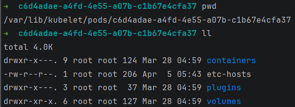
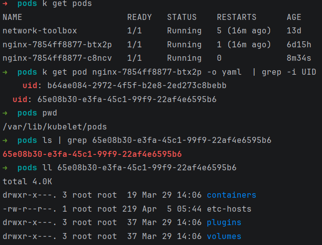
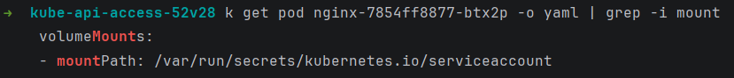
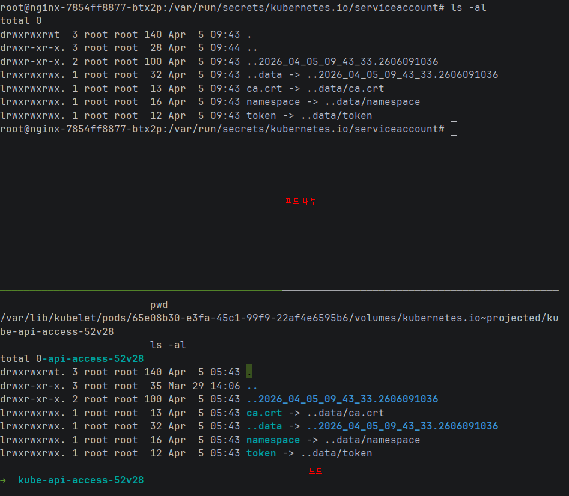

## 목차

- [1장 Volumn 이란?](#1장-volumn-이란)
  - [1️⃣ Volume이란 무엇인가](#1️⃣-volume이란-무엇인가)
  - [2️⃣ 한 줄 정리](#2️⃣-한-줄-정리)
  - [3️⃣ 왜 필요한가 (문제 상황)](#3️⃣-왜-필요한가-문제-상황)
  - [4️⃣ 전체 구조 (큰 그림)](#4️⃣-전체-구조-큰-그림)
  - [5️⃣ 실제 실행 위치](#5️⃣-실제-실행-위치)
  - [6️⃣ 실제 Linux에서 어디 저장되는가](#6️⃣-실제-linux에서-어디-저장되는가)
  - [7️⃣ 실제 Linux에서 확인하는 방법](#7️⃣-실제-linux에서-확인하는-방법)
    - [1️⃣ Pod UID 확인](#1️⃣-pod-uid-확인)
    - [2️⃣ 실제 데이터 확인](#2️⃣-실제-데이터-확인)
  - [8️⃣ 컨테이너에서 어떻게 보이는가](#8️⃣-컨테이너에서-어떻게-보이는가)
  - [9️⃣ Volume 종류](#9️⃣-volume-종류)
  - [🔟 핵심 개념](#-핵심-개념)
    - [1️⃣ Pod 단위](#1️⃣-pod-단위)
    - [2️⃣ Container 공유](#2️⃣-container-공유)
    - [3️⃣ Node에서 관리](#3️⃣-node에서-관리)
  - [11. 실제 생성 흐름 (중요)](#11-실제-생성-흐름-중요)
  - [12. kubelet 내부 구조](#12-kubelet-내부-구조)
  - [13. 실제로 만들어보자](#13-실제로-만들어보자)
  - [14. Volume lifecycle](#14-volume-lifecycle)
  - [15. 가장 중요한 흐름](#15-가장-중요한-흐름)
- [2장 Storage 아키텍처 쿠버네티스 내부 흐름](#2장-storage-아키텍처-쿠버네티스-내부-흐름)
  - [1️⃣ Volume Manager](#1️⃣-volume-manager)
    - [흐름](#흐름)
    - [실제 동작 흐름](#실제-동작-흐름)
    - [kubelet 내부 구조](#kubelet-내부-구조)
    - [핵심 개념](#핵심-개념)
      - [Desired State](#desired-state)
      - [Actual State](#actual-state)
      - [reconciler](#reconciler)
    - [Volume Manager는 실제 Linux에서 어디에 존재하나](#volume-manager는-실제-linux에서-어디에-존재하나)
    - [kubelet 설정 파일](#kubelet-설정-파일)
    - [실제 Volume 데이터 저장 위치](#실제-volume-데이터-저장-위치)
    - [실제 확인 방법](#실제-확인-방법)
      - [Pod UID 찾기](#pod-uid-찾기)
      - [실제 mount 확인](#실제-mount-확인)
    - [Volume Manager 실제 코드 위치](#volume-manager-실제-코드-위치)
    - [Volume Manager 핵심 알고리즘](#volume-manager-핵심-알고리즘)
    - [실제 동작 예](#실제-동작-예)
    - [Volume Manager 중요 포인트](#volume-manager-중요-포인트)
  - [2️⃣ Volume Plugin](#2️⃣-volume-plugin)
    - [구조](#구조)
    - [실제 plugin 종류](#실제-plugin-종류)
    - [Kubernetes plugin 코드 위치](#kubernetes-plugin-코드-위치)
    - [Volume Plugin 동작](#volume-plugin-동작)
    - [실제 Linux mount](#실제-linux-mount)
    - [Volume Plugin lifecycle](#volume-plugin-lifecycle)
    - [Volume Plugin 종류](#volume-plugin-종류)
- [3장 각각 무엇인지 알아보자](#3장-각각-무엇인지-알아보자)
  - [1️⃣ emptyDir](#1️⃣-emptydir)
    - [언제 생성되나](#언제-생성되나)
    - [어디서 실행되나](#어디서-실행되나)
    - [실제 Linux 저장 위치](#실제-linux-저장-위치)
    - [실제 확인](#실제-확인)
    - [종류](#종류)
      - [disk 기반](#disk-기반)
      - [memory 기반](#memory-기반)
      - [Linux](#linux)
    - [핵심 개념](#핵심-개념-1)
  - [2️⃣ hostPath](#2️⃣-hostpath)
    - [실제 Linux에서는](#실제-linux에서는)
      - [실제 파일](#실제-파일)
      - [위험성](#위험성)
  - [3️⃣ CSI Driver](#3️⃣-csi-driver)
    - [왜 필요한가?](#왜-필요한가)
    - [구조](#구조-1)
    - [실제 구성](#실제-구성)
    - [Node에서 위치](#node에서-위치)
    - [실제 구조](#실제-구조)
    - [대표적인 CSI API](#대표적인-csi-api)
    - [흐름](#흐름-1)
  - [4️⃣ overlayfs](#4️⃣-overlayfs)
    - [왜 필요한가](#왜-필요한가-1)
    - [overlayfs 구조](#overlayfs-구조)
    - [실제 Linux 위치](#실제-linux-위치)
    - [실제 mount](#실제-mount)
    - [컨테이너 filesystem](#컨테이너-filesystem)
    - [⭐ Volume vs OverlayFS (중요)](#-volume-vs-overlayfs-중요)
    - [전체 구조 (진짜 중요)](#전체-구조-진짜-중요)
    - [🔥 쿠버네티스 스토리지 전체 구조](#-쿠버네티스-스토리지-전체-구조)
- [4장 그렇다면 실제 마운트는 어떻게 될까](#4장-그렇다면-실제-마운트는-어떻게-될까)
  - [1️⃣ 먼저 전체 흐름부터](#1️⃣-먼저-전체-흐름부터)
  - [2️⃣ bind mount](#2️⃣-bind-mount)
    - [일반 mount](#일반-mount)
    - [bind mount](#bind-mount)
  - [3️⃣ Kubernetes에서 bind mount](#3️⃣-kubernetes에서-bind-mount)
  - [4️⃣ container runtime mount](#4️⃣-container-runtime-mount)
  - [5️⃣ overlayfs와 관계](#5️⃣-overlayfs와-관계)
  - [6️⃣ mount propagation](#6️⃣-mount-propagation)
    - [private](#private)
    - [shared](#shared)
    - [slave](#slave)
  - [7️⃣ Kubernetes에서 mount propagation](#7️⃣-kubernetes에서-mount-propagation)
    - [None](#none)
    - [HostToContainer](#hosttocontainer)
    - [Bidirectional](#bidirectional)
  - [8️⃣ 왜 mount propagation 필요할까](#8️⃣-왜-mount-propagation-필요할까)

---

# 1장 Volumn 이란?

## 1️⃣ Volume이란 무엇인가

정의

```
쿠버네티스에서 컨테이너의 데이터를 저장하고 공유하기 위한 저장 공간이다.

컨테이너는 기본적으로 stateless라서 재시작하면 파일이 사라지는데,
Volume을 사용하면 데이터를 유지하거나 여러 컨테이너가 공유할 수 있다.
```

## 2️⃣ 한 줄 정리

```
Volume = Pod 내부 컨테이너들이 사용하는 저장공간을 Pod 밖에서 관리하는 Kubernetes 저장소
```

## 3️⃣ 왜 필요한가 (문제 상황)

컨테이너는 기본적으로 ephemeral filesystem이다.

예시

```
container
 ├─ /app
 ├─ /tmp
 └─ /data
```

컨테이너가 죽으면 다음 명령어가 실행된다

```
docker rm

→ 모든 파일 삭제
```

그래서 필요한 것이 Volume 이다.

예

```
Container
   │
   │ mount
   ▼
Volume
```

## 4️⃣ 전체 구조 (큰 그림)

쿠버네티스 Volume 구조는 이렇게 된다.

```
Application
   │
   ▼
Container
   │
   ▼
VolumeMount
   │
   ▼
Volume
   │
   ▼
Volume Plugin
   │
   ▼
Node filesystem or Network storage
```

실제 구조

```
Pod
 ├─ container1
 │   └─ mountPath: /data
 │
 ├─ container2
 │   └─ mountPath: /data
 │
 └─ Volume
     └─ hostPath / PVC / emptyDir
```

## 5️⃣ 실제 실행 위치

Volume은 Node에서 실행된다.

왜냐하면

```
Pod → Node에 스케줄됨
```

그래서

```
Volume lifecycle = Pod lifecycle
```

대부분의 Volume은

```
Node filesystem
```

위에 만들어진다.

## 6️⃣ 실제 Linux에서 어디 저장되는가

Node에서 보면 여기 있다.

```
/var/lib/kubelet/pods/
```

Pod별 directory

```
/var/lib/kubelet/pods/<pod-uid>/
```

그 안에

```
volumes/
```

예

```
/var/lib/kubelet/pods/

  9a8f23f3-1234-1234-1234-abcdef/
      ├─ containers/
      ├─ volumes/
      │    ├─ kubernetes.io~empty-dir/
      │    │     └─ data/
      │    └─ kubernetes.io~secret/
      │          └─ token/
      └─ etc-hosts
```



## 7️⃣ 실제 Linux에서 확인하는 방법

### 1️⃣ Pod UID 확인

```
kubectl get pod -o wide
또는
kubectl get pod <pod> -o yaml
```

UID 확인

```
metadata:
uid: 9a8f23f3-1234
```

### 2️⃣ 실제 데이터 확인

예

```
cd volumes/kubernetes.io~empty-dir/data
ls
```

여기 파일이 컨테이너 내부 /data 와 동일



## 8️⃣ 컨테이너에서 어떻게 보이는가

컨테이너에서는

```
mountPath
```

로 보인다.

예

```
containers:
- name: app
  image: nginx
  volumeMounts:
  - name: data
    mountPath: /data
```




```
실제 Linux에서는 mount 로 연결된다.
```

Node에서 보면

```
mount | grep kubelet
```

예

```
/var/lib/kubelet/pods/.../volumes/... on /var/lib/docker/overlay2/.../merged/data
```

## 9️⃣ Volume 종류

대표적인 것들

| 타입                  | 설명                   |
| --------------------- | ---------------------- |
| emptyDir              | Pod 살아있는 동안 유지 |
| hostPath              | Node filesystem 사용   |
| configMap             | 설정 파일              |
| secret                | 비밀 데이터            |
| persistentVolume (PV) | 영구 저장소            |
| PVC                   | PV 요청                |
| nfs                   | network storage        |
| CSI                   | external storage       |

## 🔟 핵심 개념

Volume 이해 핵심은 3가지

### 1️⃣ Pod 단위

```
Volume은 Pod lifecycle 에 묶인다.
```

### 2️⃣ Container 공유

여러 container가 공유 가능

```
Pod
 ├ container1
 ├ container2
 └ volume
```

### 3️⃣ Node에서 관리

```
Volume은 kubelet 이 관리한다.
```

## 11. 실제 생성 흐름 (중요)

Pod 생성하면 내부에서 이렇게 진행된다.

```
kubectl apply
     │
     ▼
API Server
     │
     ▼
Scheduler
     │
     ▼
Node 선택
     │
     ▼
kubelet
     │
     ▼
Volume Manager
     │
     ▼
Volume Plugin 실행
     │
     ▼
filesystem mount
     │
     ▼
container start
```

## 12. kubelet 내부 구조

```
Volume은 kubelet 내부의 Volume Manager가 담당한다.
```

구성

```
kubelet
 ├─ pod manager
 ├─ container runtime
 └─ volume manager
       ├─ attach
       ├─ mount
       └─ unmount
```

## 13. 실제로 만들어보자

예제 Pod

```yaml
apiVersion: v1
kind: Pod
metadata:
  name: volume-test
spec:
  containers:
    - name: app
      image: busybox
      command: ["sleep", "3600"]

      volumeMounts:
        - name: data
          mountPath: /data

  volumes:
    - name: data
      emptyDir: {}
```

컨테이너 접속

```
kubectl exec -it volume-test -- sh
```

파일 생성

```
echo hello > /data/test.txt
```

Node 확인

```
/var/lib/kubelet/pods/<uid>/volumes/kubernetes.io~empty-dir/
```

같은 파일 보임.

```
node : k8s-worker1

➜  pwd
/var/lib/kubelet/pods/15455713-ba3e-4fbf-8f21-66f8a31776f8/volumes/kubernetes.io~empty-dir/data

➜  ls
test.txt

➜  cat test.txt
hello
```

## 14. Volume lifecycle

```
Pod 생성
   │
Volume 생성
   │
Container mount
   │
Pod 실행
   │
Pod 삭제
   │
Volume 삭제
```

```
단, PVC / PV는 삭제 안됨
```

## 15. 가장 중요한 흐름

Volume 흐름 핵심

```
Pod spec
   │
   ▼
kubelet
   │
   ▼
volume plugin
   │
   ▼
filesystem mount
   │
   ▼
container mountPath
```

Volume에서 가장 중요한건

```
Pod는 network namespace 공유
Pod는 volume도 공유
```

그래서 Pod 정의는 사실

```
network + storage 공유 단위
```

이다.

---

# 2장 Storage 아키텍처 쿠버네티스 내부 흐름

## 1️⃣ Volume Manager

한 줄 정리

```
Volume Manager = kubelet 내부에서 Volume을 생성 / mount / unmount 관리하는 컴포넌트
```

역할

```
Pod YAML에 Volume이 정의되어 있으면
kubelet이 Volume Manager에게 생성 요청을 한다.
```

### 흐름

```
Pod 생성
   │
   ▼
kubelet
   │
   ▼
Volume Manager
   │
   ├─ attach
   ├─ mount
   └─ unmount
```

### 실제 동작 흐름

```
Pod 생성
kubectl apply
   │
   ▼
API server
Pod spec 전달
   │
   ▼
Node
kubelet
   │
   ▼
kubelet 내부
volume manager
   │
   ▼
실행
mount volume
   │
   ▼
그 후
container start
```

### kubelet 내부 구조

kubelet 내부에는 다음 구조가 있다.

```
kubelet
 ├─ pod manager
 ├─ container runtime manager
 ├─ volume manager
 ├─ secret manager
 └─ configmap manager
```

volume manager 내부

```
volume manager
 ├─ desiredStateOfWorld
 ├─ actualStateOfWorld
 ├─ reconciler
 └─ operation executor
```

이건 엄청 중요하다. 핵심 개념을 차근차근 알아보자

### 핵심 개념

Volume Manager는 두 가지 상태를 비교한다.

#### Desired State

```
Pod spec에서 원하는 상태
```

예

```
Pod
 └─ volume: emptyDir
```

#### Actual State

현재 Node에 존재하는 volume

```
/var/lib/kubelet/pods/
```

#### reconciler

둘을 비교해서 맞춘다.

```
desired != actual
```

그러면

```
mount 실행
```

### Volume Manager는 실제 Linux에서 어디에 존재하나

Volume Manager는 kubelet process 내부 코드다.

```
즉 파일로 존재하는 것이 아니라 kubelet binary 안에 포함되어 있다.
```

Node에서 확인

```
ps aux | grep kubelet
```

### kubelet 설정 파일

보통

```
/var/lib/kubelet/config.yaml
또는
/etc/kubernetes/kubelet.conf
```

### 실제 Volume 데이터 저장 위치

Node

```
/var/lib/kubelet/pods/
```

예

```
/var/lib/kubelet/pods/<pod-uid>/volumes/
```

### 실제 확인 방법

#### Pod UID 찾기

```
kubectl get pod -o yaml
```

Node에서

```
cd /var/lib/kubelet/pods
```

Volume 확인

```
ls volumes
```

#### 실제 mount 확인

Node에서

```
mount | grep kubelet
```

예

```
tmpfs on /var/lib/kubelet/pods/.../volumes/... type tmpfs
```

### Volume Manager 실제 코드 위치

쿠버네티스 소스코드

```
pkg/kubelet/volumemanager/
```

중요 파일

```
volume_manager.go
```

구조

```
pkg/kubelet/volumemanager/

 ├─ volume_manager.go
 ├─ reconciler/
 ├─ cache/
 ├─ populator/
 └─ operationexecutor/
```

### Volume Manager 핵심 알고리즘

Volume Manager는 reconciliation loop를 돌린다.

```
loop
  │
  ▼
check desired state
  │
  ▼
check actual state
  │
  ▼
mount/unmount
```

### 실제 동작 예

Pod 생성

```
volumes:
- name: data
  emptyDir: {}
```

kubelet

```
volume manager
```

결과 Node에 해당 마운트 생성

```
/var/lib/kubelet/pods/<uid>/volumes/kubernetes.io~empty-dir/
```

### Volume Manager 중요 포인트

```
Volume Manager는 volume type을 직접 구현하지 않는다.

이는 Volume Plugin이 한다.
```

## 2️⃣ Volume Plugin

한 줄 정리

```
Volume Plugin = 실제 Volume 타입을 구현하는 드라이버
```

예

```
emptyDir
hostPath
nfs
aws-ebs
ceph
configMap
secret
```

이 모든 것은

```
Volume Plugin
```

이다.

### 구조

```
Volume Manager
      │
      ▼
Volume Plugin
      │
      ▼
filesystem / network storage
```

### 실제 plugin 종류

Node에서

```
/var/lib/kubelet/plugins/
```

예

```
/var/lib/kubelet/plugins/

kubernetes.io
csi
```

Volume plugin directory

```
/var/lib/kubelet/plugins/kubernetes.io/

[예시 : node 에서 실행]
➜  pwd
/var/lib/kubelet/pods/65e08b30-e3fa-45c1-99f9-22af4e6595b6/plugins
➜  ll
total 0
drwxr-x---. 3 root root 43 Mar 29 14:06 kubernetes.io~empty-dir
```

예

```
empty-dir
host-path
configmap
secret
```

### Kubernetes plugin 코드 위치

쿠버네티스 소스

```
pkg/volume/
```

예

```
pkg/volume/

 ├─ emptydir
 ├─ hostpath
 ├─ secret
 ├─ configmap
 └─ nfs
```

### Volume Plugin 동작

예

```
emptyDir
```

plugin

```
pkg/volume/emptydir
```

실행

```
mkdir
mount tmpfs
```

### 실제 Linux mount

예

```
emptyDir
```

Node에서

```
mount | grep tmpfs
```

예

```
tmpfs on /var/lib/kubelet/pods/... type tmpfs
```

### Volume Plugin lifecycle

```
Volume Manager
    │
    ▼
Plugin Init
    │
    ▼
Attach
    │
    ▼
Mount
    │
    ▼
Container mount
```

### Volume Plugin 종류

대표

| plugin    | 설명               |
| --------- | ------------------ |
| emptyDir  | temporary storage  |
| hostPath  | node filesystem    |
| configMap | config injection   |
| secret    | secret injection   |
| nfs       | network filesystem |
| csi       | external driver    |

---

# 3장 각각 무엇인지 알아보자

## 1️⃣ emptyDir

한 줄 정리

```
Pod가 생성될 때 Node에 만들어지고 Pod가 삭제될 때 같이 삭제되는 임시 Volume
```

역할

```
컨테이너 간 임시 데이터 공유
```

예

```
Pod
 ├ container1
 ├ container2
 └ emptyDir
```

둘 다 같은 디렉토리를 사용.

### 언제 생성되나

```
Pod start
```

kubelet이 생성

```
kubelet
 → volume manager
 → emptyDir plugin
```

### 어디서 실행되나

```
Node
```

정확히는

```
kubelet process
```

### 실제 Linux 저장 위치

Node에서

```
/var/lib/kubelet/pods/<pod-uid>/volumes/kubernetes.io~empty-dir/
```

예

```
/var/lib/kubelet/pods/

  9123abcd
     volumes
       kubernetes.io~empty-dir
         data/
```

### 실제 확인

Pod UID 확인

```
kubectl get pod -o yaml
```

Node

```
cd /var/lib/kubelet/pods
```

mount 확인

```
mount | grep kubelet

[예]
tmpfs on /var/lib/kubelet/pods/... type tmpfs
```

또는

```
ext4
```

### 종류

#### disk 기반

```
emptyDir: {}
```

Node disk 사용

#### memory 기반

```
emptyDir:
  medium: Memory
```

#### Linux

```
tmpfs
```

### 핵심 개념

emptyDir lifecycle

```
Pod start
  │
  ▼
emptyDir 생성
  │
  ▼
containers mount
  │
  ▼
Pod delete
  │
  ▼
volume 삭제
```

## 2️⃣ hostPath

한 줄 정리

```
Node의 실제 파일을 Pod에 mount 하는 Volume
```

역할

```
Node filesystem 공유
```

예

```
Node
 └ /var/log

Pod
 └ /logs
```

Pod 예

```
volumes:
- name: log-volume
  hostPath:
    path: /var/log
```

실제 구조

```
Node filesystem
      │
      ▼
/var/log
      │
      ▼
mount
      │
      ▼
container /logs
```

### 실제 Linux에서는

```
단순한 bind mount 이다.
```

확인

```
mount | grep logs
```

#### 실제 파일

Node

```
/var/log
```

Container

```
/logs
```

동일 파일.

#### 위험성

hostPath는

```
Node root access
```

가능

예

```
hostPath: /
→ 노드 전체 접근
```

그래서 production에서는 거의 안씀

## 3️⃣ CSI Driver

한 줄 정리

```
외부 스토리지(NFS, AWS EBS, Ceph 등)를 Kubernetes에서 사용할 수 있게 하는 표준 인터페이스
```

### 왜 필요한가?

```
예전에는 Volume plugin이 Kubernetes core code안에 있었다.
그래서 새 스토리지 추가 하려면 Kubernetes rebuild해야 했다.
```

### 구조

```
Kubernetes
   │
   ▼
CSI driver
   │
   ▼
Storage system
```

예

```
AWS EBS
Ceph
NFS
GCE disk
```

### 실제 구성

CSI driver는 Pod로 실행된다.

```
kube-system namespace
```

예

```
kubectl get pods -n kube-system
```

예

```
ebs-csi-controller
ebs-csi-node
```

### Node에서 위치

```
/var/lib/kubelet/plugins/
```

예

```
/var/lib/kubelet/plugins/

csi/
```

### 실제 구조

Node

```
kubelet
  │
  ▼
csi plugin socket
  │
  ▼
csi driver pod
  │
  ▼
storage
```

### 대표적인 CSI API

대표 API

```
CreateVolume
DeleteVolume
NodePublishVolume
NodeUnpublishVolume
```

### 흐름

```
Pod
 │
 ▼
PVC
 │
 ▼
PV
 │
 ▼
CSI driver
 │
 ▼
storage create
```

## 4️⃣ overlayfs

이건 쿠버네티스보다 리눅스 핵심 기술이다. 컨테이너 filesystem의 핵심.

한 줄 정리

```
여러 filesystem layer를 하나의 filesystem처럼 보이게 하는 Linux filesystem
```

### 왜 필요한가

```
Docker image는 layer로 구성된다.
```

예

```
ubuntu layer
python layer
app layer
```

### overlayfs 구조

```
lowerdir
upperdir
workdir
merged

[실제]
lowerdir → image layers
upperdir → container write layer
merged → container filesystem
```

그림

```
image layer
     │
     ▼
lowerdir
     │
     ▼
overlayfs
     │
     ▼
merged
     │
     ▼
container rootfs
```

### 실제 Linux 위치

containerd

```
/var/lib/containerd/io.containerd.snapshotter.v1.overlayfs/
```

docker

```
/var/lib/docker/overlay2/
```

### 실제 mount

```
mount | grep overlay
```

예

```
overlay on /var/lib/containerd/.../rootfs
```

### 컨테이너 filesystem

```
container rootfs
   │
   ▼
overlayfs
   │
   ▼
image layers
```

### ⭐ Volume vs OverlayFS (중요)

컨테이너 구조

```
container
   │
   ▼
overlayfs (image filesystem)
   │
   ▼
volume mount

즉, overlayfs 위에 volume mount된다.
```

예

```
/app → overlayfs
/data → volume
```

### 전체 구조 (진짜 중요)

```
container filesystem

        overlayfs
           │
           ▼
       image layer

        + volume mount
           │
           ▼
        emptyDir / hostPath / CSI
```

### 🔥 쿠버네티스 스토리지 전체 구조

```
Pod
 │
 ▼
Volume
 │
 ▼
Volume Manager
 │
 ▼
Volume Plugin
 │
 ▼
Linux mount
 │
 ▼
Container runtime
 │
 ▼
overlayfs rootfs
```

---

# 4장 그렇다면 실제 마운트는 어떻게 될까

## 1️⃣ 먼저 전체 흐름부터

Pod에 Volume이 있으면 실제로는 이렇게 된다.

```
Pod spec
   │
   ▼
kubelet
   │
   ▼
volume 생성
   │
   ▼
Node filesystem 생성
   │
   ▼
bind mount
   │
   ▼
container rootfs에 mount


즉 핵심은 Volume은 Linux mount를 이용해서 컨테이너 filesystem에 붙는다.
```

## 2️⃣ bind mount

한 줄 정리

```
이미 존재하는 디렉토리를 다른 위치에 연결하는 Linux mount
```

### 일반 mount

디스크를 mount하는 문법이다.

```
mount /dev/sdb1 /data
```

### bind mount

디스크가 아니라 directory를 연결

```
mount --bind /host/data /container/data
```

구조

```
/host/data
     │
     ▼
bind mount
     │
     ▼
/container/data
```

같은 파일을 본다.

실제 예

```
data1 폴더에 txt 를 만든다.
➜  mkdir /data1
➜  echo hello > /data1/a.txt

data1 폴더를 data2 폴더에 마운트 한다.
➜  mkdir /data2
➜  mount --bind /data1 /data2

확인
➜  ls /data2

결과
➜  a.txt
```

## 3️⃣ Kubernetes에서 bind mount

쿠버네티스 Volume은 대부분 bind mount다.

예

```
Node
➜  /var/lib/kubelet/pods/<uid>/volumes/empty-dir/data
```

```
이걸 container rootfs로 mount 한다.
```

구조

```
Node filesystem
   │
   ▼
/var/lib/kubelet/pods/<uid>/volumes/data
   │
   ▼
bind mount
   │
   ▼
container rootfs /data
```

확인

Node에서

```
mount | grep kubelet
```

예

```
/var/lib/kubelet/pods/.../volumes/... on /run/containerd/.../rootfs/data
```

## 4️⃣ container runtime mount

컨테이너는 root filesystem을 가지고 있다.

예

```
container rootfs
```

실제 위치

```
containerd 경우

/run/containerd/io.containerd.runtime.v2.task/k8s.io/<container-id>/rootfs
```

```
➜  pwd
/run/containerd/io.containerd.runtime.v2.task/k8s.io/5605383e6101d6698b14518a8b40c2ee0a1c851efbc1981e953de9fcca39f2dd

➜  ls
address      init.pid  log.json      rootfs   shim-binary-path
config.json  log       options.json  runtime  work

➜  ls rootfs
bin   dev                  docker-entrypoint.sh  home  lib64  mnt  proc  run   srv  tmp  var
boot  docker-entrypoint.d  etc                   lib   media  opt  root  sbin  sys  usr
```

Volume mount

```
bind mount

그래서 /data 가 Volume이 된다.
```

## 5️⃣ overlayfs와 관계

```
컨테이너 filesystem은 overlayfs 위에서 동작한다.
```

구조

container filesystem

```
overlayfs
 ├ lowerdir (image layers)
 ├ upperdir (container write)
 └ merged (container root)
```

Volume은 overlayfs 위에 mount 된다.

```
overlayfs merged
       │
       ▼
volume mount
```

예

```
/app   → overlayfs
/data  → volume
```

그래서

```
volume은 overlayfs를 덮어쓴다
```

## 6️⃣ mount propagation

이건 Kubernetes에서 매우 중요하다.

한 줄 정리

```
mount 변화가 다른 mount namespace로 전달되는 방식
```

Linux에는 3가지가 있다.

```
private
shared
slave
```

### private

기본값

```
mount 변화 전달 안됨
```

### shared

```
mount 변화 서로 공유
```

### slave

```
host → container 전달
container → host 전달 안됨
```

## 7️⃣ Kubernetes에서 mount propagation

Pod spec

```yaml
volumeMounts:
  - mountPath: /data
    mountPropagation: HostToContainer
```

옵션

```
None
HostToContainer
Bidirectional
```

### None

```
기본값
```

### HostToContainer

```
host mount → container 전달
```

### Bidirectional

```
container mount → host 전달
```

## 8️⃣ 왜 mount propagation 필요할까

예

```
CSI driver : storage mount

이걸 container 에서 봐야 한다.

그래서 Bidirectional를 사용한다.
```
