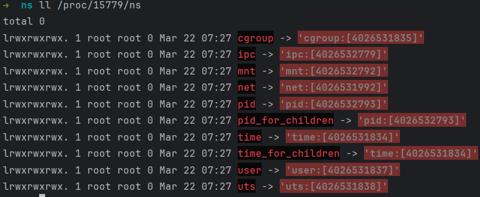
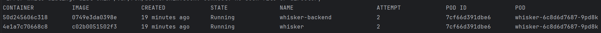
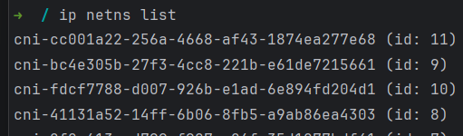
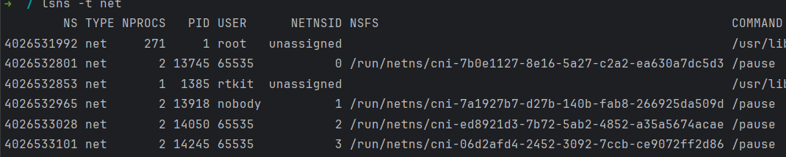
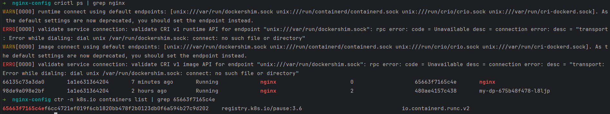
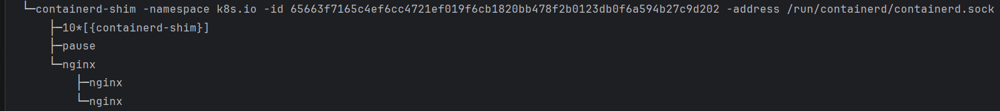
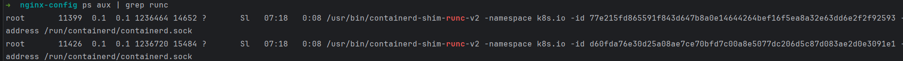

## 목차

- [1장 Pod 란](#1장-pod-란)
  - [1️⃣ Pod란 무엇인가 (컨테이너 관점)](#1️⃣-pod란-무엇인가-컨테이너-관점)
    - [🔥 Pod 내부 구조 전체 그림](#-pod-내부-구조-전체-그림)
  - [2️⃣ Pod의 핵심 구조 (Pause Container)](#2️⃣-pod의-핵심-구조-pause-container)
    - [pause container 의 역할](#pause-container-의-역할)
  - [3️⃣ Pod 생성 시 실제 Linux 동작](#3️⃣-pod-생성-시-실제-linux-동작)
    - [pause container 생성](#pause-container-생성)
  - [4️⃣ Pod namespace 구조](#4️⃣-pod-namespace-구조)
    - [리눅스에서 namespace란 무엇인가](#리눅스에서-namespace란-무엇인가)
    - [Linux namespace 종류](#linux-namespace-종류)
    - [namespace는 실제로 어디에 존재하는가](#namespace는-실제로-어디에-존재하는가)
    - [namespace 확인](#namespace-확인)
    - [Pod가 namespace를 공유한다는 의미](#pod가-namespace를-공유한다는-의미)
    - [Pod namespace 구조](#pod-namespace-구조)
    - [실제 Linux에서 Pod namespace 확인](#실제-linux에서-pod-namespace-확인)
    - [network namespace 직접 확인](#network-namespace-직접-확인)
    - [namespace 진짜 핵심](#namespace-진짜-핵심)
  - [5️⃣ Pod 내부 네트워크 구조](#5️⃣-pod-내부-네트워크-구조)
  - [6️⃣ Pod 내부 process 구조](#6️⃣-pod-내부-process-구조)
  - [7️⃣ Pod lifecycle](#7️⃣-pod-lifecycle)
    - [Pod 상태 흐름](#pod-상태-흐름)
    - [Pod 생성 과정](#pod-생성-과정)
  - [8️⃣ Multi-container Pod](#8️⃣-multi-container-pod)
  - [9️⃣ Pod ↔ kubelet 상호작용](#9️⃣-pod--kubelet-상호작용)
- [2장 pause container](#2장-pause-container)
  - [1️⃣ pause container](#1️⃣-pause-container)
  - [2️⃣ Kubernetes에서 pause container 이름](#2️⃣-kubernetes에서-pause-container-이름)
  - [3️⃣ crictl로 pause container 찾기](#3️⃣-crictl로-pause-container-찾기)
    - [Pod 기준으로 보기](#pod-기준으로-보기)
  - [4️⃣ containerd (ctr)로 찾기](#4️⃣-containerd-ctr로-찾기)
  - [5️⃣ pause container PID 찾기](#5️⃣-pause-container-pid-찾기)
  - [6️⃣ namespace 확인](#6️⃣-namespace-확인)
  - [7️⃣ Pod network interface 확인](#7️⃣-pod-network-interface-확인)
  - [🔥 Kubernetes 내부 용어 (중요)](#-kubernetes-내부-용어-중요)
  - [pause container를 찾으면 Pod 네트워크 디버깅이 가능하다.](#pause-container를-찾으면-pod-네트워크-디버깅이-가능하다)
- [3장 실제로 어떻게 생성되는지 알아보자](#3장-실제로-어떻게-생성되는지-알아보자)
  - [흐름](#흐름)
  - [1️⃣ Pod 생성 요청](#1️⃣-pod-생성-요청)
  - [2️⃣ kubelet 감지](#2️⃣-kubelet-감지)
  - [3️⃣ containerd Pod Sandbox 생성](#3️⃣-containerd-pod-sandbox-생성)
  - [5️⃣ runc → namespace 생성](#5️⃣-runc--namespace-생성)
  - [6️⃣ namespace 확인](#6️⃣-namespace-확인-1)
  - [7️⃣ CNI plugin 호출](#7️⃣-cni-plugin-호출)
  - [8️⃣ network namespace 파일](#8️⃣-network-namespace-파일)
  - [9️⃣ veth pair 생성](#9️⃣-veth-pair-생성)
  - [10. Pod namespace에 interface 이동](#10-pod-namespace에-interface-이동)
  - [11. Pod namespace 내부 인터페이스](#11-pod-namespace-내부-인터페이스)
  - [12. Host bridge 연결](#12-host-bridge-연결)
  - [13. Pod IP 설정](#13-pod-ip-설정)
  - [14. Host routing 확인](#14-host-routing-확인)
  - [🔥 전체 Pod 네트워크 구조 (실제 Linux)](#-전체-pod-네트워크-구조-실제-linux)
- [4장 외전 내가 알고 싶은것들](#4장-외전-내가-알고-싶은것들)
  - [1️⃣ Pod IP는 어디서 할당되는가](#1️⃣-pod-ip는-어디서-할당되는가)
    - [IPAM 동작](#ipam-동작)
    - [IP 할당 기록 파일](#ip-할당-기록-파일)
  - [2️⃣ Pod CIDR](#2️⃣-pod-cidr)
  - [3️⃣ Cgroup이란 무엇인가](#3️⃣-cgroup이란-무엇인가)
    - [Cgroup이 제한하는 것](#cgroup이-제한하는-것)
    - [Cgroup 파일 시스템](#cgroup-파일-시스템)
    - [Kubernetes Pod cgroup](#kubernetes-pod-cgroup)
    - [Pod cgroup 확인](#pod-cgroup-확인)
    - [Kubernetes 핵심 구조 정리](#kubernetes-핵심-구조-정리)
- [5장 Pod.yaml](#5장-podyaml)
  - [1️⃣ Kubernetes Pod YAML은 "모든 옵션"이 있는 문서가 아니다](#1️⃣-kubernetes-pod-yaml은-모든-옵션이-있는-문서가-아니다)
  - [2️⃣ Pod YAML 전체 예제 (거의 모든 옵션)](#2️⃣-pod-yaml-전체-예제-거의-모든-옵션)
  - [3️⃣ Pod YAML 실제 동작 흐름](#3️⃣-pod-yaml-실제-동작-흐름)
  - [4️⃣ Pod 정보는 etcd에 저장된다.](#4️⃣-pod-정보는-etcd에-저장된다)
    - [etcd 내부](#etcd-내부)
  - [5️⃣ Pod YAML을 "모든 옵션" 확인하는 공식 방법](#5️⃣-pod-yaml을-모든-옵션-확인하는-공식-방법)

---

# 1장 Pod 란

## 1️⃣ Pod란 무엇인가 (컨테이너 관점)

Kubernetes에서 Pod는 스케줄링의 최소 단위다.

하지만 리눅스 관점에서 보면 Pod는 이것이다.

```
Pod = 여러 container가 공유하는 namespace 묶음

즉,
container
container
container
   ↓
shared namespaces

영어로, shared namespace container group이다.
```

Pod 내부 컨테이너는 다음을 공유할 수 있다.

```
network namespace
ipc namespace
uts namespace
volume
```

가장 중요한 것은 이것이다.

```
Pod = 하나의 IP

즉
Pod 내부 모든 container
→ 같은 IP
→ 같은 port space
```

### 🔥 Pod 내부 구조 전체 그림

```
Node
│
├ kubelet
│
├ containerd
│
└ Pod
    │
    ├ pause container
    │    └ namespace holder
    │
    ├ container1
    │
    └ container2
         │
         shared network namespace
         │
         eth0
         │
         veth pair
         │
Host veth
         │
cni0 bridge
```

---

## 2️⃣ Pod의 핵심 구조 (Pause Container)

Pod에서 가장 중요한 컨테이너는 사실 application container가 아니다. 핵심은 pause container 이다.

### pause container 의 역할

```
Pod namespace holder 의 역할을 한다.

즉
Pod namespace
   ↑
pause container가 유지

구조:
Pod
├ pause
├ container1
└ container2

namespace는 pause container가 생성한다.

다른 컨테이너는 --net=container:pause 처럼 붙는다.
```

---

## 3️⃣ Pod 생성 시 실제 Linux 동작

Pod 생성 전체 흐름을 다시 보면

```
kubectl apply
↓
kube-apiserver
↓
etcd 저장
↓
kube-scheduler
↓
node 결정
↓
kubelet
```

여기부터가 중요하다. kubelet은 CRI 호출한다.

```
kubelet
↓
CRI
↓
container runtime
(containerd)
```

containerd 내부

```
containerd
↓
containerd-shim
↓
runc
```

이제 실제 Linux syscall이 실행된다.

### pause container 생성

```
systemcall : clone()

namespace 생성 :
CLONE_NEWNET
CLONE_NEWPID
CLONE_NEWIPC
CLONE_NEWUTS
CLONE_NEWNS

즉, 새 namespace 공간 생성
```

---

## 4️⃣ Pod namespace 구조

```
Pod 내부 namespace 구조:

Pod
├ network namespace
├ pid namespace
├ ipc namespace
├ uts namespace
└ mount namespace

예 :
Pod 내부 hostname은 Pod 이름이 된다.
왜냐하면 UTS namespace를 공유하기 때문이다.
```

### 리눅스에서 namespace란 무엇인가

리눅스에서 namespace는 프로세스가 보는 시스템 자원을 격리하는 커널 기능이다.
<br>즉, 쉽게 말하면 프로세스마다 "다른 세계"를 만들어주는 기능

일반 리눅스에서는 ps aux하면 모든 프로세스가 보인다.
<br>하지만 PID namespace 안에서는 자기 namespace 프로세스만 보인다

```
➜ ps aux
[Host]
PID
1 systemd
2 kthreadd
100 nginx

[Container 내부]
PID
1 nginx
2 worker

container에서는 자기가 'PID 1' 이다.
왜냐하면 PID namespace 때문이다.
```

### Linux namespace 종류

리눅스에는 여러 namespace가 있다. 대표적으로 다음과 같은 namespace 가 있다.

| namespace | 의미                |
| --------- | ------------------- |
| pid       | 프로세스 번호       |
| net       | 네트워크 인터페이스 |
| mnt       | 파일시스템 mount    |
| ipc       | shared memory       |
| uts       | hostname            |
| user      | uid/gid             |
| cgroup    | cgroup view         |

이때 컨테이너에서 중요한 것은 다음과 같다.

```
PID
NET
MNT
IPC
UTS
```

### namespace는 실제로 어디에 존재하는가

namespace는 커널 객체다. 하지만 Linux에서는 이것을 파일처럼 표현한다.

```
/proc/<PID>/ns/
```



```
각 파일은 실제 namespace를 가리킨다.
예시로 /proc/1/ns/net 이 파일은 PID 1 프로세스의 network namespace를 가리킨다.
```

### namespace 확인

실제로 한번 확인해보자.

```
ls -l /proc/self/ns

[예시 출력]
net -> net:[4026532008]
pid -> pid:[4026531836]
mnt -> mnt:[4026531840]
uts -> uts:[4026531838]

위의 숫자들은 namespace ID 이다.
즉, 같은 namespace = 같은 ID 이다.
```

### Pod가 namespace를 공유한다는 의미

이제 Kubernetes로 돌아오자. Pod에는 여러 container가 있다.

```
Pod
 ├ container1
 └ container2
```

이 컨테이너들은 같은 network namespace 를 쓴다.

```
즉, Pod = 하나의 network namespace
```

그래서 이런 일이 가능하다.

```
[container1] (서버를 열음)
python server.py
port 8080

[container2] (서버 응답을 받음)
curl localhost:8080

위와 같이 되는 이유는
localhost = 같은 network namespace 이기 때문이다.
```

### Pod namespace 구조

Pod 생성시 먼저 생성되는 것이 pause container이다.

pause container가 namespace holder역할을 한다.

구조

```
Pod
 ├ pause
 ├ container1
 └ container2

container1,2는 pause container namespace에 붙는다.
예: --net=container:pause
```

### 실제 Linux에서 Pod namespace 확인

노드에서 Pod namespace를 확인할 수 있다.

먼저 Pod pause container 찾는다.

```
crictl ps
또는
ctr containers list
```



pause container PID 찾았다면 namespace 를 확인한다.

```
➜  ls -l /proc/12345/ns

[예]
net -> net:[4026532801]
```

이제 다른 container도 확인한다.

```
➜  ls -l /proc/<containerPID>/ns

[예]
net -> net:[4026532801]
```

```
따라서 pause container 와 container는 같은 network namespace를 가지고 있다.
```

### network namespace 직접 확인

Linux에서 network namespace 확인

```
ip netns list
```



하지만 Kubernetes는 보통 ip netns에 직접 등록하지 않는다.

그래서 확인하려면 lsns를 사용한다.

```
lsns -t net
```



### namespace 진짜 핵심

namespace는 사실 process attribute이다.

각 process는 namespace pointer를 가지고 있다.

커널 구조

```
task_struct
   │
   └ nsproxy
        ├ net_ns
        ├ pid_ns
        ├ mnt_ns

즉, process → namespace 참조하는 구조다.
```

---

## 5️⃣ Pod 내부 네트워크 구조

Pod network 구조는 이렇다.

```
Pod network namespace
     │
     eth0
     │
     veth pair
     │
Host veth
     │
     cni0 bridge
```

```
즉 Pod 내부에서는 ip addr 하면 :
eth0
10.244.x.x
처럼 보인다.

하지만 실제 NIC는 아니며, veth 일 뿐이다.
```

---

## 6️⃣ Pod 내부 process 구조

Pod 내부 container들은 밑과 같이 존재한다.

```
Pod
 ├ pause
 ├ container1
 └ container2
```

하지만 Linux process tree로 보면 다음과 같다.

```
containerd-shim
 ├ pause
 ├ nginx
 └ sidecar
```

```
즉, Pod은 사실 process group 같은 개념이다.
```

---

## 7️⃣ Pod lifecycle

### Pod 상태 흐름

```
Pending
Running
Succeeded
Failed
Unknown
```

### Pod 생성 과정

```
Pod 생성
↓
image pull
↓
container create
↓
container start
↓
```

이를 kubelet이 지속적으로 상태를 확인한다.

```
container runtime
↓
status report
↓
kubelet
↓
apiserver
```

---

## 8️⃣ Multi-container Pod

Pod에는 여러 container가 들어갈 수 있다.

```
[예시]
Pod
 ├ app container
 ├ logging sidecar
 └ metrics exporter
```

이들이 공유하는 것은 다음과 같다.

```
IP
localhost
volume
```

```
예시로 container1에서 curl localhost:8080 가능하다.
왜냐하면 network namespace 공유하기 때문이다.
```

## 9️⃣ Pod ↔ kubelet 상호작용

kubelet이 하는 핵심 역할은 다음과 같다.

```
PodSpec 감시
↓
container runtime 호출
↓
Pod 상태 관리
```

kubelet 루프

```
watch apiserver
↓
PodSpec
↓
desired state
↓
actual state 비교
↓
container 생성 / 삭제
```

```
즉, Kubernetes = reconciliation loop
```

---

# 2장 pause container

## 1️⃣ pause container

Pod 생성 시 가장 먼저 만들어지는 container가 있다.

```
이름 : pause container
역할 : Pod namespace holder
```

즉 이 컨테이너가

```
network namespace
ipc namespace
uts namespace

를 유지한다.
```

Pod 구조

```
Pod
 ├ pause
 ├ app container
 └ sidecar

중 app container는 pause container namespace에 들어간다.
```

## 2️⃣ Kubernetes에서 pause container 이름

Kubernetes에서는 pause container를 sandbox container라고도 부른다.

```
이미지는 보통
registry.k8s.io/pause 이다.
```

이 이미지는 아무것도 안 하는 프로그램이다.

코드도 단순하다.

```
pause();

그래서 이름이 pause다.
```

## 3️⃣ crictl로 pause container 찾기

Node에서 가장 쉽게 찾는 방법은 이것이다.

```
➜  crictl ps

CONTAINER           IMAGE                POD
8f32e3a...          nginx:1.25           nginx-pod
aa23cda...          registry.k8s.io/pause:3.9   nginx-pod
```

여기서

```
이 container 들이 pause container다.
```

### Pod 기준으로 보기

```
➜  crictl pods

POD ID        NAME
b13f...       nginx-pod
```

그 다음

```
➜  crictl ps --pod b13f

CONTAINER    IMAGE
pause        registry.k8s.io/pause:3.9
nginx        nginx:1.25

여기서 pause가 Pod sandbox다.
```

## 4️⃣ containerd (ctr)로 찾기

containerd를 직접 보면

```
➜  ctr -n k8s.io containers list | grep pause

CONTAINER                    IMAGE                           RUNTIME
025fa8000bd5c3f4b8b8d8...    registry.k8s.io/pause:3.6       io.containerd.runc.v2
05bdf504e85bad1aa9d552...    registry.k8s.io/pause:3.6       io.containerd.runc.v2
0d36a252fcf027b4775b09...    registry.k8s.io/pause:3.6       io.containerd.runc.v2
```

## 5️⃣ pause container PID 찾기

pause container의 PID를 찾으면 Pod 의 namespace를 볼 수 있다.

```
➜  crictl inspect <container-id>
```

```
➜  pods crictl inspect 0ecbcf90f9e7a | grep "pid"
...
    "pid": 15395,
            "pid": 1
            "type": "pid"
...
```

## 6️⃣ namespace 확인

```
ls -l /proc/21345/ns

[예]
net -> net:[4026532801]
pid -> pid:[4026532802]
mnt -> mnt:[4026532803]

이 namespace가 Pod namespace이다.
```

## 7️⃣ Pod network interface 확인

pause container namespace에 들어가면 Pod 네트워크를 볼 수 있다.

```
➜  nsenter -t <pod-pid> -n ip addr
2: eth0@if16: ...
    inet 10.244.1.7/32 scope global eth0
       valid_lft forever preferred_lft forever
              ...
```

eth0 이게 바로 Pod 의 IP 이다.

## 🔥 Kubernetes 내부 용어 (중요)

Kubernetes runtime 내부에서는 Pod을 PodSandbox 라고 부른다.

container runtime 구조

```
PodSandbox (pause)
   │
   ├ container
   ├ container
   └ container
```

```
즉, pause container = PodSandbox 이다.
```

## pause container를 찾으면 Pod 네트워크 디버깅이 가능하다.

```
Pod IP 확인
nsenter -t <pausePID> -n ip addr

routing 확인
nsenter -t <pausePID> -n ip route

iptables 확인
nsenter -t <pausePID> -n iptables -L
```

---

# 3장 실제로 어떻게 생성되는지 알아보자

## 흐름

```
1️⃣ Pod 생성 요청 발생
2️⃣ kubelet이 하는 일
3️⃣ containerd → Pod Sandbox 생성
4️⃣ runc → namespace 생성 (clone)
5️⃣ pause container 실행
6️⃣ CNI 호출
7️⃣ veth pair 생성
8️⃣ Pod network namespace에 eth0 생성
9️⃣ Host bridge (cni0) 연결
🔟 Pod IP 설정

그리고 매 단계마다

어떤 파일
어떤 명령어
어떤 리눅스 객체

로 확인 가능한지 같이 보겠다.
```

## 1️⃣ Pod 생성 요청

사용자가 실행

```
➜  kubectl run nginx --image=nginx

이 명령어는 실제로 kubectl → kube-apiserver로 HTTP 요청을 보낸다.
```

확인 방법

```
➜  kubectl get pods
또는
➜  kubectl get pods -o wide

NAME     READY   STATUS    IP          NODE
nginx    1/1     Running   10.244.1.5  node1
```

## 2️⃣ kubelet 감지

Node에서는 kubelet이 지속적으로 API Server를 watch한다.

kubelet이 하는 일

```
PodSpec 확인
↓
container runtime 호출 (CRI)
```

kubelet process 확인

```
➜  ps aux | grep kubelet

USER         PID %CPU %MEM  ...  STAT START   TIME COMMAND
root       11259  5.8  1.0  ...  Ssl  07:18   5:38 /usr/bin/kubelet
```

kubelet 상태 확인

```
systemctl status kubelet
```

로그 확인

```
journalctl -u kubelet
```

## 3️⃣ containerd Pod Sandbox 생성

kubelet은 CRI (Container Runtime Interface) 를 사용한다.

Pod 내부 container 확인

```
➜  crictl ps

[출력]
CONTAINER ID   IMAGE                        POD
3bc21d...      nginx:latest                 nginx
7fd21c...      registry.k8s.io/pause:3.9    nginx

여기서 registry.k8s.io/pause가 pause container다.
```

```
➜  ctr -n k8s.io containers list | grep 65663f7165...
65663f7165...    registry.k8s.io/pause:3.6     io.containerd.runc.v2
```



```
➜  pstree -aln
```



## 5️⃣ runc → namespace 생성

containerd는 실제 container 실행을 위해 runc 를 호출한다.

```
➜  ps aux | grep runc
```



```
container 생성 시 clone() syscall이 실행된다.
이 syscall은 namespace 생성 옵션을 사용한다.

[예]
CLONE_NEWNET
CLONE_NEWPID
CLONE_NEWNS
CLONE_NEWIPC
CLONE_NEWUTS
```

## 6️⃣ namespace 확인

pause container PID 찾기

```
crictl inspect <pause-container-id> | grep pid

➜  crictl ps
CONTAINER           IMAGE               CREATED             STATE               NAME                        ATTEMPT             POD ID              POD
66135c73a3da0       1a1e631364204       13 minutes ago      Running             nginx                       0                   65663f7165c4e       nginx

➜  crictl inspect 66135c73a3da0 | grep pid
    "pid": 75171,
            "pid": 1
            "type": "pid"

```

namespace 확인

```
➜  ls -l /proc/75171/ns
net -> net:[4026532801]
pid -> pid:[4026532802]
mnt -> mnt:[4026532803]
uts -> uts:[4026532804]
ipc -> ipc:[4026532805]
```

## 7️⃣ CNI plugin 호출

pause container가 생성되면 kubelet이 CNI plugin 호출한다.

CNI 실행 파일 위치

```
➜  ls /opt/cni/bin
bridge
calico
flannel
host-local
loopback
```

CNI config 파일 위치

```
➜  ls /etc/cni/net.d
-rw-------. 1 root root  713 Mar 22 07:19 10-calico.conflist
-rw-------. 1 root root 2.7K Mar 22 07:19 calico-kubeconfig
```

CNI plugin은 ADD command 를 받는다.

이때 전달되는 정보

```
Container ID
Network namespace path
Interface name
Pod IP
```

## 8️⃣ network namespace 파일

Pod network namespace 경로

```
/proc/75171/ns
```

CNI plugin은 이 namespace에 들어간다.

```
network namespace 진입명령어 :
➜  nsenter -t 75171 -n

nsenter 의 명령어의 DESCRIPTION 을 man으로 검색하면 다음과 같다.
Enters the namespaces of one or more other processes and then executes the specified program.
If program is not given, then ``${SHELL}'' is run (default: /bin/sh).

한마디로 namespace 에 enter(진입) 한다.
```

## 9️⃣ veth pair 생성

CNI plugin이 실행하는 명령과 유사한 것

```
➜  ip link add veth123 type veth peer name veth456

이렇게 하면 veth123 ↔ veth456 pair가 만들어진다.
```

확인

```
ip link

[예]
veth8f23@if4
vethb3a1@if6
```

## 10. Pod namespace에 interface 이동

Host에서 생성된 veth 중 하나를 Pod network namespace로 이동시킨다.

```
ip link set veth456 netns 75171
```

## 11. Pod namespace 내부 인터페이스

Pod namespace에서 확인

```
➜  nsenter -t 75171 -n ip addr
...
3: eth0@if23: <BROADCAST,MULTICAST,UP,LOWER_UP>
    inet 10.96.0.230/32 scope global eth0
...

➜  net.d k get pods nginx -o json | grep ip
                "ip": "10.96.0.230"
```

이것이 Pod Network Interface 이다.

## 12. Host bridge 연결

Host 쪽 veth는 cni0 bridge에 연결된다.

확인

```
ip link show <device-id>
또는
bridge link

➜  ip link show calic440f455693
```

구조

```
Pod namespace
    eth0
      │
   veth pair
      │
Host veth
      │
     cni0
      │
Node network
```

## 13. Pod IP 설정

CNI plugin이 IP 설정하는데 Pod namespace에서 확인이 가능하다.

Pod namespace 내부 확인

```
IP
➜  nsenter -t 75171 -n ip addr
...
3: eth0@if23: <BROADCAST,MULTICAST,UP,LOWER_UP>
    inet 10.96.0.230/32 scope global eth0
...

routing 확인
➜  nsenter -t 75171 -n ip route
default via 169.254.1.1 dev eth0
169.254.1.1 dev eth0 scope link
```

## 14. Host routing 확인

Node routing table 확인해보자

```
➜  ip route
10.96.0.230 dev calic440f455693 scope link

위의 의미는 Pod network → cni0 bridge 이다.
```

## 🔥 전체 Pod 네트워크 구조 (실제 Linux)

```
Pod namespace
   │
   eth0 (10.244.1.5)
   │
veth pair
   │
Host veth
   │
cni0 bridge
   │
Node network
```

| 확인 대상       | 명령            |
| --------------- | --------------- |
| pause container | crictl ps       |
| Pod sandbox     | crictl pods     |
| container PID   | crictl inspect  |
| namespace       | ls /proc/PID/ns |
| namespace 진입  | nsenter         |
| 인터페이스      | ip link         |
| IP              | ip addr         |
| routing         | ip route        |
| bridge          | bridge link     |

---

# 4장 외전 내가 알고 싶은것들

## 1️⃣ Pod IP는 어디서 할당되는가

```
결론부터 말하면

Pod IP = CNI plugin의 IPAM이 할당

Kubernetes 자체는 IP를 직접 할당하지 않는다.
```

```
구조:
kubelet
   ↓
CNI plugin 호출
   ↓
IPAM plugin
   ↓
Pod IP 할당

IPAM = IP Address Management
```

실제 호출 흐름

```
Pod 생성 시 kubelet이 실행하는 흐름 :

pause container 생성
↓
CNI ADD 호출
↓
network interface 생성
↓
IPAM 실행
↓
Pod IP 할당
```

### IPAM 동작

대부분 CNI에서 사용하는 IPAM은 host-local이며, 이 IPAM은 Node 로컬에서 IP를 관리한다.

설정 파일 확인

```
➜  vi /etc/cni/net.d/10-calico.conflist

내용을 보면
...
{
  "ipam": {
    "type": "host-local",
    "ranges": [
      [
        { "subnet": "10.244.1.0/24" }
      ]
    ]
  }
}
...

여기서 10.244.1.0/24 이 바로 Node의 Pod CIDR이다.
```

### IP 할당 기록 파일

host-local IPAM은 파일로 IP 상태를 관리한다.

위치

```
/var/lib/cni/networks/
```

```
➜  pwd
/var/lib/cni/networks/code6_default
➜  ll
total 12K
-rw-r--r--. 1 root root 77 Jun 12  2025 10.4.1.19
-rw-r--r--. 1 root root 77 Jun 12  2025 10.4.1.20
-rw-r--r--. 1 root root  9 Jun 12  2025 last_reserved_ip.0
```

이 파일들의 의미는

| 파일                 | 의미                           |
| -------------------- | ------------------------------ |
| 10.4.1.19, 10.4.1.20 | 해당 IP가 사용 중              |
| last_reserved_ip     | 마지막 할당 IP가 들어있는 파일 |

```
즉 Pod IP 관리 = 파일 기반이다.
```

## 2️⃣ Pod CIDR

Node 정보 확인

```
kubectl get nodes -o wide
또는
kubectl describe node <node>
```

출력 예

```
PodCIDR: 10.244.1.0/24
```

전체 Pod 네트워크(CIDR) 구조

```
Cluster CIDR
10.244.0.0/16

Node1
  PodCIDR 10.244.1.0/24
  Pod IP
    10.244.1.2
    10.244.1.3

Node2
  PodCIDR 10.244.2.0/24
  Pod IP
    10.244.2.2
```

## 3️⃣ Cgroup이란 무엇인가

Linux 핵심 기능이다.

```
Cgroup = Control Group

의미 :
프로세스 리소스 제한 및 관리 기능

컨테이너가 가능한 이유 :
namespace + cgroup
```

### Cgroup이 제한하는 것

| 리소스 | 설명        |
| ------ | ----------- |
| cpu    | CPU 사용량  |
| memory | 메모리      |
| pids   | 프로세스 수 |
| blkio  | 디스크 IO   |
| cpuset | CPU core    |

### Cgroup 파일 시스템

cgroup은 cgroup filesystem으로 보인다.

위치

```
➜  /sys/fs/cgroup
lrwxrwxrwx.  1 root root 11 Mar 22 06:56 cpu -> cpu,cpuacct
dr-xr-xr-x.  7 root root  0 Mar 22 06:56 memory
dr-xr-xr-x.  7 root root  0 Mar 22 06:56 pids
...
```

### Kubernetes Pod cgroup

Kubernetes는 Pod마다 cgroup을 만든다.

확인

```
➜  systemd-cgls

kubepods
 ├ kubepods-burstable
 │   └ pod12345
 │       ├ container1
 │       └ container2


위 구조는 다음과 같다.

kubepods
   │
   ├ pod
   │   ├ container
   │   └ container
```

### Pod cgroup 확인

```
container PID 찾기
crictl inspect <container-id>

PID 확인 후
cat /proc/<PID>/cgroup

예
0::/kubepods/burstable/pod123/container123


➜  cgroup cat /proc/75171/cgroup
12:hugetlb:/kubepods-besteffort-pod84892775_d1ed_4443....slice:cri-containerd:66135c73a3da...
11:cpuset:/kubepods-besteffort-pod84892775_d1ed_4443....slice:cri-containerd:66135c73a3da...
10:devices:/system.slice/containerd.service/kubepods-besteffort-pod84892775_d1ed_4443....slice:cri-containerd:66135c73a3da...
9:cpu,cpuacct:/system.slice/containerd.service/kubepods-besteffort-pod84892775_d1ed_4443....slice:cri-containerd:66135c73a3da...
```

### Kubernetes 핵심 구조 정리

Pod 네트워크

```
Pod
  eth0
   │
veth pair
   │
cni0
   │
Node network
```

IP 할당

```
Node CIDR
   ↓
CNI IPAM
   ↓
Pod IP
```

리소스 관리

```
Pod
   │
cgroup
   │
CPU / Memory 제한
```

---

# 5장 Pod.yaml

## 1️⃣ Kubernetes Pod YAML은 "모든 옵션"이 있는 문서가 아니다

Pod YAML은 Kubernetes API Object야.

즉, 실제 정의는 Kubernetes API Server의 PodSpec / Pod Object Schema로 정의되어 있어.

```
구조는 이렇게 생긴다.

Pod
 ├─ apiVersion
 ├─ kind
 ├─ metadata
 ├─ spec
 │   ├─ containers
 │   ├─ volumes
 │   ├─ restartPolicy
 │   ├─ nodeSelector
 │   ├─ affinity
 │   ├─ tolerations
 │   ├─ serviceAccountName
 │   ├─ securityContext
 │   ├─ hostNetwork
 │   ├─ dnsPolicy
 │   ├─ imagePullSecrets
 │   ├─ initContainers
 │   ├─ ephemeralContainers
 │   └─ ...
 └─ status (runtime 정보)
```

## 2️⃣ Pod YAML 전체 예제 (거의 모든 옵션)

```yaml
apiVersion: v1
kind: Pod

metadata:
  name: my-pod
  namespace: default
  labels:
    app: nginx
  annotations:
    description: example pod

spec:
  restartPolicy: Always

  nodeSelector:
    disktype: ssd

  serviceAccountName: default

  hostNetwork: false
  hostPID: false
  hostIPC: false

  dnsPolicy: ClusterFirst

  imagePullSecrets:
    - name: regcred

  securityContext:
    runAsUser: 1000
    fsGroup: 2000

  containers:
    - name: nginx
      image: nginx:latest

      command: ["nginx"]
      args: ["-g", "daemon off;"]

      workingDir: /usr/share/nginx/html

      ports:
        - containerPort: 80
          protocol: TCP

      env:
        - name: ENV
          value: prod

      envFrom:
        - configMapRef:
            name: my-config

      resources:
        limits:
          cpu: "1"
          memory: "512Mi"
        requests:
          cpu: "500m"
          memory: "256Mi"

      volumeMounts:
        - name: data
          mountPath: /data

      livenessProbe:
        httpGet:
          path: /
          port: 80
        initialDelaySeconds: 10
        periodSeconds: 5

      readinessProbe:
        httpGet:
          path: /
          port: 80
        initialDelaySeconds: 5
        periodSeconds: 3

      startupProbe:
        httpGet:
          path: /
          port: 80
        failureThreshold: 30
        periodSeconds: 10

      lifecycle:
        postStart:
          exec:
            command: ["echo", "started"]
        preStop:
          exec:
            command: ["echo", "stopping"]

      securityContext:
        privileged: false
        allowPrivilegeEscalation: false

  initContainers:
    - name: init
      image: busybox
      command: ["sh", "-c", "echo init"]

  volumes:
    - name: data
      emptyDir: {}

  tolerations:
    - key: "node-role.kubernetes.io/control-plane"
      operator: "Exists"
      effect: "NoSchedule"

  affinity:
    nodeAffinity:
      requiredDuringSchedulingIgnoredDuringExecution:
        nodeSelectorTerms:
          - matchExpressions:
              - key: disktype
                operator: In
                values:
                  - ssd

  terminationGracePeriodSeconds: 30
```

## 3️⃣ Pod YAML 실제 동작 흐름

이 YAML이 실제로 어떻게 동작하는지 보자.

```
kubectl apply -f pod.yaml

[흐름]
kubectl
   ↓
API Server
   ↓
etcd (저장)
   ↓
Scheduler
   ↓
Node 선택
   ↓
kubelet
   ↓
Container Runtime
   ↓
containerd / CRI-O
   ↓
container 생성
```

## 4️⃣ Pod 정보는 etcd에 저장된다.

### etcd 내부

Pod은 JSON으로 저장된다.

예시 key

```
/registry/pods/default/my-pod
```

확인 방법

```
(컨트롤플레인에서)
etcdctl get /registry/pods/default/my-pod
```

## 5️⃣ Pod YAML을 "모든 옵션" 확인하는 공식 방법

실무에서 가장 많이 쓰는 방법.

```
kubectl explain pod.spec
```

예

```
kubectl explain pod.spec.containers
```

또는

```
kubectl explain pod --recursive
```

그러면 모든 옵션이 트리 구조로 나온다.
